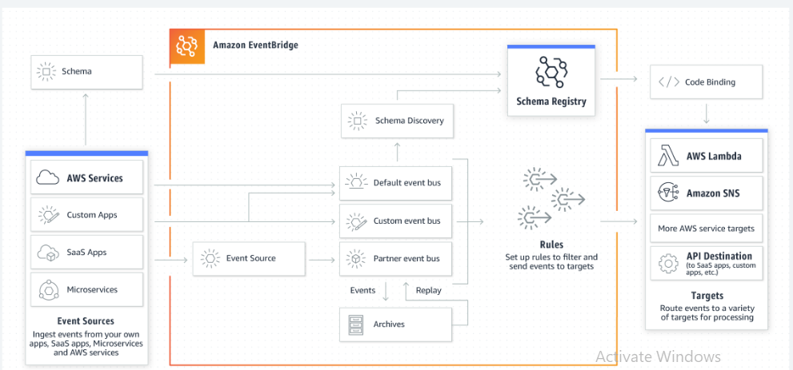

# Building Event Driven Application Architecture

**Overview**

-   Many customers are adopting event-driven application architectures,
    where subscriber or target services automatically respond to events
    triggered by publisher or source services.

-   This architecture pattern allows development teams to work more
    independently, enabling faster release of new features.

-   Event-driven architectures also contribute to making applications
    more scalable.

-   In this workshop, you will:

    -   Learn the basics of event-driven design.

    -   Discover how to choose the appropriate AWS service for different
        use cases.

    -   Gain insights on optimizing for both cost and performance.

    -   Engage in hands-on practice to acquire the skills needed to
        implement event-driven design patterns in your own applications.

This project can be run inside your own AWS accounts. To enable you to
follow the steps, we need to set up and configure a number of AWS
services. We have made provisioning these services as simple as
possible. We will leverage AWS CloudFormation, which allows us to codify
our infrastructure. Select your preferred region to which you will
deploy the template. Just click the Launch link to create the stack in
your account.

{width="6.5in" height="3.0368055555555555in"}

Prerequisite: Launch the AWS CloudFormation template This CloudFormation
template is designed to deploy a comprehensive environment for an AWS
workshop that covers event-driven architectures, with key components
like Cognito for authentication, SNS for messaging, EventBridge for
event management, Lambda for serverless functions, and a custom Visual
Studio Code environment.

**Steps for First event bus and targets:**

1.  Create a custom event bus

2.  Create Rule

3.  Select Event Source

4.  Select a Target (CloudWatch Group)

5.  Test the Rule and verify in Log group

**Working with EventBridge rules: Steps**

a\. API Destination Challenge

1.  Identify the API URL

2.  Configure the EventBridge API Destination with Basic Auth Security

3.  Configure an EventBridge rule to target the EventBridge API
    Destination

4.  Send Test Orders Event

5.  Verify API Destination

b\. Step Functions Challenge

1.  Implement an EventBridge rule to target steps functions

2.  Send Test EU Orders Events

3.  Verify Step Functions Workflow Execution

c\. SNS Challenge

1.  Implement an EventBridge rule to target SNS

2.  Send test US Orders Events

3.  Verify SNS Topic

### Launch the AWS CloudFormation Template

1.  Enter a stack name (or just keep the default name).

2.  **Check** the boxes in the **Capabilities** section.

3.  Click **Create stack**.

4.  Using the CloudFormation template the following Services will be
    created.

-   CognitoUserPool

-   SNS

-   EventBridge

-   Lambda

-   Vscode

{width="6.5in" height="2.692361111111111in"}

## First event bus and targets

In this module, you\'ll set up a custom EventBridge event bus named
\"Orders\" and create an EventBridge rule called \"OrderDevRule.\" This
rule will capture all events directed to the \"Orders\" event bus and
forward them to a CloudWatch Logs log group, \"/aws/events/orders.\"
Logging events in CloudWatch Logs is a valuable approach for monitoring
and troubleshooting EventBridge rules.

### Create a Custom event bus

1.  Open the AWS Management Console for
    EventBridge  in a new
    tab or window, so you can keep this step-by-step guide open.

2.  On the EventBridge homepage, under Buses, select Event buses from
    the left navigation.

3.  Name the event bus Orders..

4.  Leave Event archive and Schema discovery disabled, Resource-based
    policy blank.

5.  Click Create.

> {width="3.5079549431321086in"
> height="2.5485148731408573in"}

### Creating EventBridge Rule:

A simple way to test and get rapid feedback for the rules you create for
your event bus is to use Amazon CloudWatch as a target. We will create a
rule for the Orders bus that will act as a \"catch-all\" for every event
passed to the bus, irrespective of source.

When you choose \"All events\" as the event source in EventBridge, every
event that comes to the event bus will trigger this rule. This can lead
to a very large number of actions being triggered, which could increase
costs. There's also a risk of creating endless loops where the rule
keeps triggering itself repeatedly. To avoid this, it\'s important to
write the rules in a way that the actions triggered by the rule do not
trigger the same rule again. In this project, we will only handle events
from the source \"com.aws.orders\" to keep it controlled.

1.  From the left-hand menu, select Rules.

2.  From the Event bus dropdown, select the Orders event bus.

3.  Click Create rule.

> Define rule detail:

4.  Add OrdersDevRule  as the Name of the rule.

5.  Add Catchall rule for development purposes  for Description.

6.  Select **Rule with an event pattern** for the Rule type.

> {width="4.961537620297463in"
> height="4.155818022747156in"}

7.  In the next step, **Build event pattern.**

-   For Event source, choose Other.

8.  Under Event pattern, further down the screen, enter the following
    pattern to catch all events from com.aws.orders:

> {width="4.989583333333333in"
> height="1.0104166666666667in"}

### Select your rule target

9.  From the Target dropdown, select CloudWatch log group.

10. Name your log group /aws/events/orders

> . {width="6.5in" height="3.7416666666666667in"}

11. Skip through the configure tags section, review your rule
    configuration and click **Create Rule.**

### Test your dev rule

1.  Select the **Event buses** in the left pane and select **Send
    events** to test the newly created event rule.

2.  Make sure that the custom event is populated with the following:

    -   **Event Bus** selected to Orders.

    -   **Source** should be com.aws.orders

    -   In the **Detail Type** add Order Notification

    -   JSON payload for the **Event detail** should be:

> {width="6.5in" height="1.2006944444444445in"}

3.  Click **Send.**

> {width="6.5in" height="5.05in"}

4.  Open the AWS Management Console for
    CloudWatch  in a
    new tab or window, so you can keep this step-by-step guide open.

5.  Choose **Log groups** in the left navigation and select
    the **/aws/events/orders** log group.

6.  Select the Log stream.

7.  Toggle the log event to verify that you received the event.

# **Working with EventBridge rules**

Rules in EventBridge match incoming events and route them to one or more
targets for processing. These targets are processed simultaneously, and
the order of processing is not guaranteed. Each rule can customize the
JSON data sent to the targets, either by including specific parts of the
event or by replacing it with a constant value. EventBridge supports
over 28 AWS service targets!

In this module, you will learn how to create an Orders event bus rule.
This rule will match events with the com.aws.orders source and route
them to three targets: an Amazon API Gateway endpoint, an AWS Step
Functions state machine, and an Amazon Simple Notification Service (SNS)
topic.

The targets (API Gateway endpoint, AWS Step Functions state machine, and
Amazon SNS topic) have already been set up for you. Your task is to
write event bus rules to match the events and verify that they are
correctly delivered to each target.

{width="6.5in" height="2.563888888888889in"}

## API Destination Challenge

Step 1: Identify the API
URL

1.  Open the AWS Management Console for
    CloudFormation
    You can find the API URL for this challenge in the **Outputs** of
    the **CloudFormation Stack** with a name containing **ApiUrl.**

Step 2: Configure the EventBridge API Destination with basic auth
security
1.  Open the AWS Management Console for
    EventBridge  in a new
    tab or window, so you can keep this step-by-step guide open.

2.  On the **EventBridge** homepage, select **API destinations** from
    the left navigation.

3.  On the **API destinations** page, select Create API destination.

4.  On the Create API destination page:

-   Enter api-destination  as the Name.

-   Enter the API URL identified in Step 1 as the API destination
    endpoint.

-   Select POST as the HTTP method.

-   Select Create a new connection for the Connection.

-   Enter basic-auth-connection  as the Connection name.

-   Select Basic (Username/Password) as the Authorization type.

-   Enter myUsername  as the Username.

-   Enter myPassword  as the Password.

Step 3: Configure an EventBridge rule to target the EventBridge API
Destination

1.  From the left-hand menu, select Rules.

2.  From the Event bus dropdown, select the Orders event bus.

3.  Click Create rule.

4.  On the Define rule detail page:

-   Enter OrdersEventsRule  as the Name of the rule.

-   Enter Send com.aws.orders source events to API Destination
     for Description.

5.  Under Build event pattern:

-   Choose Other for your Event source.

-   Copy and paste the following into the Event pattern, and
    select Next to specify your target:

{width="6.5in" height="1.2527777777777778in"}

6.  Click Next to define your target.

7.  Select your **rule target**:

-   Select **EventBridge API destination** as the target type.

-   Select Use an existing API destination, and
    **select api-destination**.

8.  Click **Next** and finish walking through the rest of the
    walk-through to create the rule.

Step 4: Send test Orders
event

Below is sample data to test your rule using  Send events function to
send an event, please refer to the previous section.

Using the Send events function, send the following Order Notification
events from the source com.aws.orders:

{width="6.5in" height="0.7243055555555555in"}

Step 5: Verify API
Destination

If the event sent to the Orders event bus matches the pattern in your
rule, then the event will be sent to an API Gateway REST API endpoint.

1.  Open the AWS Management Console for CloudWatch Log Groups  in a new
    tab or window, so you can keep this step-by-step guide open.

2.  Select the Log group with an API-Gateway-Execution-Logs prefix.

3.  Select the Log stream.

4.  Toggle the log event to verify the basic authorization was
    successful and the API responds with a 200 status.

## Step Functions Challenge

**Challenge goal**

Process **only orders from locations in the EU** (eu-west or eu-east)
using a **AWS Step Functions** target (**OrderProcessing**). In this use
case, we are demonstrating how a Step Function execution can be
triggered to process orders as they are published by the **Orders** bus.

Step 1: Implement an EventBridge rule to target Step
Functions

Use the EventBridge console to:

1.  Add a rule to the Orders event bus with the name EUOrdersRule.

2.  Define an event pattern to match events with a detail location
    in eu-west or eu-east.

3.  Create a new role for the rule.

4.  Target the OrderProcessing Step Functions state machine.

Here is a sample event to reference when writing the event pattern:

{width="6.5in" height="2.4006944444444445in"}

Step 2: Send test EU Orders
events

Using the Send events function, send the following Order Notification
 events from the source com.aws.orders :

{width="6.5in" height="1.1076388888888888in"}

Step 3: Verify Step Functions workflow
execution

If the event sent to the Orders event bus matches the pattern in your
rule, then the event will be sent to the OrderProcessing Step Functions
state machine for execution.

1.  Open the AWS Management Console for Step Functions  in a new tab or
    window, so you can keep this step-by-step guide open.

2.  On the Step Functions homepage, open the left hand navigation and
    select State machines.

3.  Enter OrderProcessing

 in the Search for state machines box and verify the state machine
execution has succeeded.

The Step Functions state machine will publish an Order Processed event
back to the Orders event bus, using a new Service Integration for
EventBridge which provides a simpler solution for producing events
during a workflow execution. We will make use of this event later in the
workshop. If you would like to see more detail on the workflow
execution, select OrderProcessing from the list of state machines, and
then select the workflow execution from the list.

## SNS Challenge

Challenge goal

Process only orders from US locations (us-west or us-east) that
are lab-supplies using a Amazon SNS target (Orders). Similar to the
previous use case, but using SNS.

Step 1: Implement an EventBridge rule to target
SNS

Use the EventBridge console to:

1.  Add a rule to the Orders event bus with the name USLabSupplyRule.

2.  With an event pattern to match events with a detail location
    in us-west or us-east, and a detail category with lab-supplies.

3.  Target the Orders SNS topic.

Here is a sample event to reference:

{width="6.5in" height="2.4097222222222223in"}

Step 2: Send test US Orders events

One of the following events should match the event rule pattern and one
should not. Use CloudWatch Logs to verify events that were successfully
sent to EventBridge but were not delivered to the target.

Using the Send events function, send the following Order Notification
 events from the source com.aws.orders :

{width="6.5in" height="1.075in"}

Step 3: Verify SNS
topic

If the event sent to the Orders event bus matches the pattern in your
rule, then the event will be sent to the Orders SQS Queue (via Orders
SNS Topic).

1.  Open the AWS Management Console for SQS  in a new tab or window, so
    you can keep this step-by-step guide open.

2.  On the SQS homepage, select the Orders queue.

3.  Select the Send and receive messages button.

4.  Select Poll for Messages and verify the first message was delivered
    and the second was not.

5.  Remove the test message by selecting it, and pressing
    the Delete button. Select the Delete button again on the Delete
    Messages confirmation dialog.
